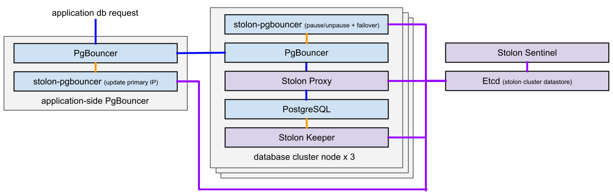

# stolon-pgbouncer [](https://circleci.com/gh/gocardless/stolon-pgbouncer/tree/master)
'stolon-pgbouncer' extends a highly-available PostgreSQL setup (managed by
[stolon](https://github.com/sorintlab/stolon)) enabling PgBouncer proxying  and
zero-downtime failover of the PostgreSQL primary.

See [Playground](#playground) for how to start a Dockerised three node stolon PostgreSQL
cluster utilising `stolon-pgbouncer`.

- stolon-pgbouncer
    - [Overview](#overview)
    - [Architecture](#architecture)
    - [Commands](#commands)
- [Playground](#playground)
    - [Architecture](#playground-architecture)
    - [Installation](#playground-installation)
    - [Commands](#playground-commands)

- [Development](#development)
    - [Images](#images)
    - [Releasing](#releasing)

### Overview
GoCardless runs a highly available PostgreSQL cluster using
[stolon](https://github.com/sorintlab/stolon). It provides us with many of the
features we need to accomplish this however for our use case and set up we
required two vital extra features.  Being able to perform zero-downtime failover
(the stolon-proxy is a layer 4 proxy and can't pause traffic) supporting the
placing of PgBouncer in front of stolon (as there is no mechanism to update the
PostgreSQL node that PgBouncer is pointing to when the master moves) are
important to us. It is from these two requirements that `stolon-pgbouncer` was
developed.

`stolon-pgbouncer` makes use of the stolon clusterview stored in etcd and has
two distinct services:
- `supervise` which runs outside of the cluster and manages our application side
  Postgres proxies (PgBouncer) ensuring they always point to the current primary
  IP
- `pauser` which runs on each PostgreSQL node and provides the pausing and
  resuming of Postgres node either side of running a stolon failkeeper.

The final component is the failover command, which speaks to the pauser
processes to trigger a manual failover.

As `stolon-pgbouncer` provides extra functionality on top of what
[stolon](https://github.com/sorintlab/stolon) already offers, this documentation
assumes an existing familiarity with it. To summarise, stolon has three main
components that are important to understand:
- keeper: Supervises, configures, and converges PostgreSQL on each PostgreSQL
  node according to the clusterview
- sentinel: Discovers and monitors the keepers, and calculates the optimal
  clusterview
- proxy: Ensures connections are pointing the master PostgreSQL node and fences
  (forcibly closes connections) to unelected masters


### Architecture
The `stolon-pgbouncer` services are expected to run on two types of machine:
alongside PgBouncer on the nodes that are members of the PostgreSQL cluster, and
on the machines, or between the PostgreSQL cluster nodes and the machines, that
will host applications which will connect to the cluster.

For a full example architecture see [Playground
Architecture](#playground-architecture).

- On the PostgreSQL node, `stolon-pgbouncer` is invoked with the
  `stolon-pgbouncer pauser` command. In this mode, it listens to requests from
  the `stolon-pgbouncer failover` command and performs pausing of the PgBouncer
  connections, issuing a `stolonctl failkeeper`, and then resuming the
  PgBouncer connections, enabling zero-downtime failovers.

- On the application side node, `stolon-pgbouncer` is invoked with the
  `stolon-pgbouncer supervise` command. This command will supervise PgBouncer
  and ensure it's always pointing to the primary PostgreSQL nodes PgBouncer by
  streaming and polling etcd for the current clulsterview, updating the
  PgBouncer configuration, and issuing a PgBouncer RELOAD.

### Commands
Each stolon-pgbouncer command has a number of configuration options and they can
be seen by passing the `-h` or `--help` flag. Each commands shares a number of
options for:
- prometheus metrics
- stolon cluster name
- etcd endpoint and timeouts

#### stolon-pgbouncer pauser
This service is designed to run on keeper nodes with PgBouncer and serves the
PgBouncer pause api via gRPC. A shared token is used to ensure requests for
pausing (and ultimately failover) are coming from an authorised caller.

It responds to 3 gRPC methods:
- HealthCheck: Checks the PgBouncers are healthy.
- Pause: Attempts to issue a `PAUSE` to PgBouncer. As PgBouncer can't pause
  connections when a transaction is open it accepts a timeout to wait for
  transactions to finish. It also accepts an expiry at which to unpause the
  PgBouncer in the event it doesn't receive a resume command.
- Resume: Issues a RESUME to PgBouncer to unpause the connections.

See `stolon-pgbouncer pauser --help` for all configuration options.

#### stolon-pgbouncer supervise
This service is designed to run between the applications and the PostgreSQL node
PgBouncers. On start up it gets the primary node IP address from the clusterview
stored in etcd and stamps out the PgBouncer configuration with this address from
the PgBouncer configuration template. It then starts PgBouncer with this
configuration ensuring that right from the start PgBouncer is pointing to the
correct location.

The supervise service will then continually stream from etcd any changes to the
primary nodes IP and will stamp out a new config and issue a `RELOAD` to
PgBouncer when it has changed. This will update connections to point to the
PgBouncer on the new primary node.

While streaming is occurring, etcd is also constantly being polled and PgBouncer
constantly being reloaded. This is a belt and braces approach and allows us to
continually test that PgBouncer is operating correctly and provide metrics on
it.

In the event of any failure, stolon-pgbouncer exits - it is assumed that some
sort of process monitoring is in place to restart to the service.

See `stolon-pgbouncer supervise --help` for all configuration options.

#### stolon-pgbouncer failover
The fail over command is responsible for orchestrating a manual zero-downtime
failover and requires that stolonctl is available locally and configured.

It first issues healthchecks on each `stolon-pgbouncer pauser` as well as
ensures that there are enough keepers (synchronous or asynchronous) to be able
to preform a zero-downtime failover. It then issues a pause on each pauser.
Assuming the pause succeeds, it will issue a `stolonctl failkeeper` locally.
Finally, on success of the failkeeper command, it will issue resume to each of
the pausers.

In the event any of the steps don't succeed, the PgBouncers are always resumed.

See `stolon-pgbouncer failover --help` for all configuration options.

## Playground
We have created a Dockerised sandbox environment that boots a three node
Postgres cluster with the `stolon-pgbouncer` services installed. The clusterview
is stored in an etcd instance and we have one application side PgBouncer
provisioned. We strongly recommend playing around in this environment to develop
an understanding of how this setup works and to simulate failure situations
(network partitions, node crashes, etc).

**It also helps to have this playground running while reading through the
README, in order to try out the commands you see along the way. See
[Installation](#playground-installation) for how to get the playground up and
running.**

### Playground Architecture
The playground consists of 3 PostgreSQL containers making up the cluster, a
Stolon sentinel container for decision making, an etcd container for the
clustview datastore, and an application side PgBouncer container to connect
through to reach the primary PostgreSQL.



#### PostgreSQL Nodes
The PostgreSQL nodes are made up of 5 components:

##### Stolon Keeper
A part of stolon and manages the PostgreSQL instance. More information can be
found in the [Stolon Architecture
documentation](https://github.com/sorintlab/stolon/blob/master/doc/architecture.md)

##### PosgreSQL
Managed by the stolon keeper.

##### Stolon Proxy
A part of stolon with two primary functions:
- To always point to the primary PostgreSQL database.
- To fence (forcibly close connections) to unelected masters. It's extremely
  important to isolate a master when it fails to ensure we no longer send any
  writes to it as these writes will be lost.

This stolon component isn't required to be ran on the same node as the stolon
keeper and PostgreSQL, and in standard stolon deployments it most likely
wouldn't be, however as we are using PgBouncer on the nodes, explained below, so
it makes sense to run it here.

Stolon proxy communicates directly to the PostgreSQL instance on the node.

The stolon proxy is accessible on port 7432 on each PostgreSQL node in the docker network and it isn't
available locally.

##### PgBouncer
We want to provide connection pooling to each PostgreSQL instance and in order
to do this, we need to run PgBouncer on the same node as PostgreSQL. As we also
want to be able to perform manual zero-downtime migrations, we also need to
issue a [PAUSE/RESUME](https://pgbouncer.github.io/usage.html) to these
PgBouncers. As the stolon proxies perform fencing, these PgBouncers need to sit
in front of the stolon proxies to prevent application connections being fenced
while we are paused during a zero-downtime failover.

PgBouncer is accessible via port 6432 on each PostgreSQL node internally to the
docker network. PgBouncer on each keeper is also available locally via port
mappings:
- keeper0 port 6433
- keeper1 port 6434
- keeper2 port 6435

##### stolon-pgbouncer pauser
Connects to the PgBouncer on the PostgreSQL node and handles the
pausing/resuming of PgBouncer connections as we as issuing `stolon failkeeper`
when running manual failovers via `stolon-pgbouncer failover`.

`stolon-pgbouncer pauser` is accessible via port 8080 on each PostgreSQL node internally
to the docker network for gRPC and it isn't accessible locally.

See the stolon-pgbouncer pauser documentation for details.

#### Application side PgBouncer Node
A single node running `stolon-pgbouncer supervise` which starts PgBouncer and
ensures that it's always pointing to PgBouncer on the primary cluster node. This
is the PgBouncer that your applications would connect to in our playground
architecture and so while performing tests and zero-downtime failovers this is
the PgBouncer that you should be connecting to.

PgBouncer is accessible locally via port 6432.

See the `stolon-pgbouncer supervise` command documentation for more details.

#### Stolon Sentinel Node
Runs a single stolon-sentinel for cluster decision making. More information can be
found in the [Stolon Architecture
documentation](https://github.com/sorintlab/stolon/blob/master/doc/architecture.md)

#### Etcd Node
Runs a single etcd node for our stolon clusterview datastore. More information can be
found in the [Stolon Architecture
documentation](https://github.com/sorintlab/stolon/blob/master/doc/architecture.md)

Ectd is accessible locally via port 2379.

### Playground Installation
First install [Docker](https://docs.docker.com/install/), [Docker
Compose](https://docs.docker.com/compose/install/), and
[Golang](https://golang.org/doc/install) >=1.12, then run:

```
# Clone into your GOPATH
$ mkdir -p $GOPATH/src/github.com/gocardless
$ cd $GOPATH/src/github.com/gocardless
$ git clone https://github.com/gocardless/stolon-pgbouncer
$ cd stolon-pgbouncer

# compile the binary
$ make linux

# start the playground (use the -d option flag to run containers in the background)
$ docker-compose up
...

# view started cluster containers
$ docker-compose ps
            Name                           Command               State                          Ports
-----------------------------------------------------------------------------------------------------------------------------
stolon-pgbouncer_etcd-store_1   etcd --data-dir=/data --li ...   Up      0.0.0.0:2379->2379/tcp, 2380/tcp
stolon-pgbouncer_keeper0_1      supervisord -n -c /stolon- ...   Up      5432/tcp, 0.0.0.0:6433->6432/tcp, 7432/tcp, 8080/tcp
stolon-pgbouncer_keeper1_1      supervisord -n -c /stolon- ...   Up      5432/tcp, 0.0.0.0:6434->6432/tcp, 7432/tcp, 8080/tcp
stolon-pgbouncer_keeper2_1      supervisord -n -c /stolon- ...   Up      5432/tcp, 0.0.0.0:6435->6432/tcp, 7432/tcp, 8080/tcp
stolon-pgbouncer_pgbouncer_1    /stolon-pgbouncer/bin/stol ...   Up      5432/tcp, 0.0.0.0:6432->6432/tcp, 7432/tcp, 8080/tcp
stolon-pgbouncer_sentinel_1     /usr/local/bin/stolon-sent ...   Up      5432/tcp, 6432/tcp, 7432/tcp, 8080/tcp

# view cluster health
$ docker exec stolon-pgbouncer_pgbouncer_1 stolonctl status
=== Active sentinels ===

ID              LEADER
57e0601b        true

=== Active proxies ===

ID
46b44f93
71fb27f0
9c1f0a65

=== Keepers ===

UID     HEALTHY PG LISTENADDRESS        PG HEALTHY      PG WANTEDGENERATION     PG CURRENTGENERATION
keeper0 true    172.24.0.4:5432         true            2                       2
keeper1 true    172.24.0.5:5432         true            2                       2
keeper2 true    172.24.0.6:5432         true            5                       5

=== Cluster Info ===

Master: keeper2

===== Keepers/DB tree =====

keeper2 (master)
├─keeper0
└─keeper1
```

### Playground Commands
#### Using stolonctl
If you set the following environment variables then stolonctl can run from your
local machine:

```
export STOLONCTL_CLUSTER_NAME=main
export STOLONCTL_STORE_BACKEND=etcdv3

$ stolonctl status
=== Active sentinels ===

ID              LEADER
3d996ae6        true

...
```

#### Connecting to stolon-pgbouncer
The PgBouncer managed by stolon-pgbouncer is exposed on port 6432 of your host
machine. You can connect to this PgBouncer like so:

```
$ psql -h localhost -p 6432 -U postgres postgres
psql (11.1, server 11.2 (Ubuntu 11.2-1.pgdg18.04+1))
Type "help" for help.

postgres=# select inet_server_addr();
 inet_server_addr
------------------
 172.18.0.6
(1 row)
```

The result of `inet_server_addr()` will be the IP address of the host that this
PgBouncer is proxying to. We expect that to the be the stolon primary. You can
also connect to the PgBouncer admin controls of the stolon-pgbouncer managed
process like so:

```
$ psql -h localhost -p 6432 -U pgbouncer pgbouncer
psql (11.1, server 1.9.0/bouncer)
Type "help" for help.

pgbouncer=# show help;
NOTICE:  Console usage
DETAIL:
        SHOW HELP|CONFIG|DATABASES|POOLS|CLIENTS|SERVERS|VERSION
        SHOW STATS|STATS_TOTALS|STATS_AVERAGES
        RELOAD
        PAUSE [<db>]
        ...
```

#### Connecting to PostgreSQL
The PostgreSQL nodes have the PgBouncer ports exposed via docker-compose onto the
host ports of 6433, 6434 and 6435 (keeper0, keeper1, keeper2). You can access
them via these ports on your local machine:
```
# Access keeper0 PgBouncer from local machine
$ psql -h localhost -p 6433 -U postgres postgres -c "select 'keeper'" -t
 keeper
```

If you want to access services other than PgBouncer on the keeper nodes then
exec into the container:

```
# From within the keeper container
$ docker-compose exec keeper0 psql -p 6432 -U postgres -c "select 'keeper'" -t
 keeper
```

#### Running stolon commands
`stolonctl` is installed and configured in all nodes except for the etcd node.
As your testing may involve stopping and starting keep nodes, it is recommended
you call `stolonctl` from a stable node such as the application side PgBouncer
(stolon-pgbouncer_pgbouncer_1).

For example the cluster health can be viewed bu running:
```
$ docker exec stolon-pgbouncer_pgbouncer_1 stolonctl status
```

#### Issuing a zero-downtime failover
`stolon-pgbouncer` is installed and configured in keeper nodes and the
application PgBouncer node.. As your testing may involve stopping and starting
keeper nodes, it is recommended you call `stolon-pgbouncer failover` from a
stable node such as the application side PgBouncer
(stolon-pgbouncer_pgbouncer_1).

To run a zero-downtime failover:
```
$ docker exec stolon-pgbouncer_pgbouncer_1 /stolon-pgbouncer/bin/stolon-pgbouncer.linux_amd64 failover
```

#### Other things to try

TODO: Add some examples of things to try in the playground.
- starting transaction and failing over
- running select now with a sleep during failover
- pausing the async and running a failover
etc

## Tests
stolon-pgbouncer comes with a full set of unit, integration and acceptance tests
written using [ginkgo](https://github.com/onsi/ginkgo) and
(gomega)[https://onsi.github.io/gomega/]. These tests are ran automatically in
CI for each PR and can also be ran locally.

To run the unit and integration test use the `test` make target. These test
require both PostgreSQL and PgBouncer to be installed. It's also required that
PostgreSQL has a role 'postgres' with `LOGIN` and no password.
```
$ make test
```

To run the acceptance tests use the `test-acceptance` make target. Running the
acceptance test will bring up the entire playground using docker-compose (if it
isn't already running). If you have issues running the acceptance tests see
(Playground Installation)[### Playground Installation].
```
$ make test-acceptance
```

The acceptance tests won't stop the playground cluster so if you are finished
with it you can manually stop it:
```
$ docker-compose stop
```

If you want to totally clean up the playground, you can run:
```
$ docker-compose down -v
```

## Development
We use the same docker-compose playground to provide a development environment
with a full stolon cluster, along with PgBouncer stolon-pgbouncer.

Running `docker-compose up` will start playground. See (Playground
Installation)[### Playground Installation].

It's important to note that we store initial cluster specification and other
stuff in docker volumes. During development it's useful to destroy the
environment fully and recreate it. Running `docker-compose down` unfortunately
destroys everything but the docker volumes, so make sure to run `docker-compose
down -v` to remove the volumes if you've changed any cluster settings in the
`./docker` directory.

### Images
There are 4 images that we use to deploy and develop stolon-pgbouncer.

#### stolon-pgbouncer-base
This image uses ubuntu 18.04 as it's base and it in turn forms the base for all
other stolon-pgbouncer images. It primarily contains PgBouncer and the
PostgreSQL client.

This image can be built and published using make targets:
````
$ make docker-base
$ make publish-base
````

https://hub.docker.com/r/gocardless/stolon-pgbouncer-base

#### stolon-pgbouncer
This image is build on top of `stolon-pgbouncer-base` and it's only addition is
the `stolon-pgbouncer` binary - it's the image we use to run the application
side PgBouncers as a deployment in kubernetes. You should either use this image
or build your own/use the release binaries for your own deployments.

This image is built and published during CI when a new release is made.

https://hub.docker.com/r/gocardless/stolon-pgbouncer

#### stolon-pgbouncer-development
This image is build on top of `stolon-pgbouncer-base` and adds all the
components and configuration for the playground. These are the `stolon`
binaries, PostgreSQL, etcd, supervisord, along with all the configuration to run
all these together.

This image can be built and published using make targets:
````
$ make docker-stolon-development
$ make publish-stolon-development
````

https://hub.docker.com/r/gocardless/stolon-development

#### stolon-pgbouncer-circleci
This image is build on top of `stolon-pgbouncer-base` and adds all components
and configuration for running our tests and releasing stolon-pgbouncer in
CircleCI.

This image can be built and published using make targets:
````
$ make docker-circleci
$ make publish-circleci
````

https://hub.docker.com/r/gocardless/stolon-pgbouncer-circleci

### Releasing
We use [goreleaser](https://github.com/goreleaser/goreleaser) to create releases
for pgsql-cluster-manager. This enables us to effortlessly create new releases
with all associated artifacts to various destinations, such as GitHub and
homebrew taps.

To generate a new release bump the `VERSION` file in a PR. Once merged to
`master`, CI will run `goreleaser` and take care of the rest.
